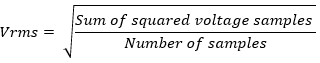
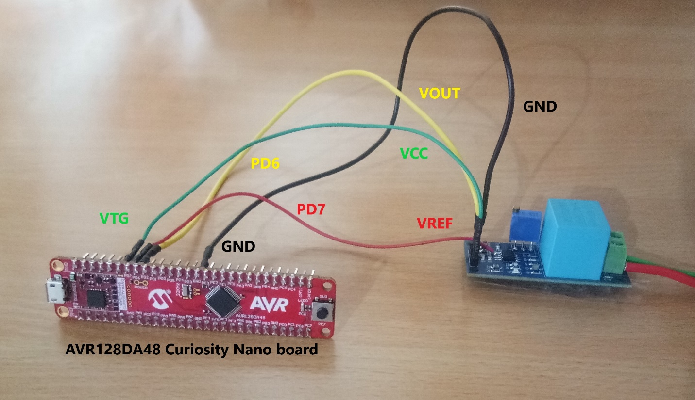
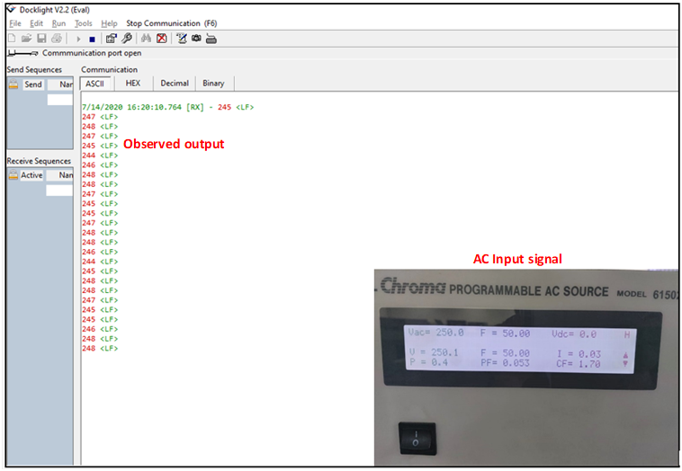
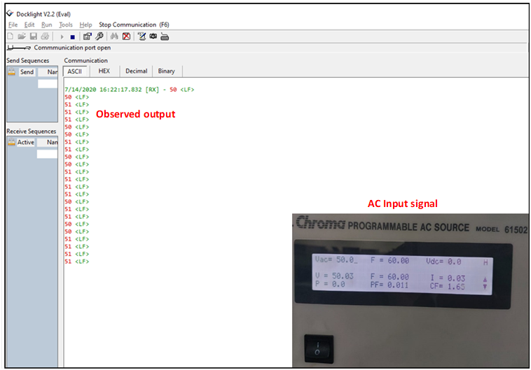
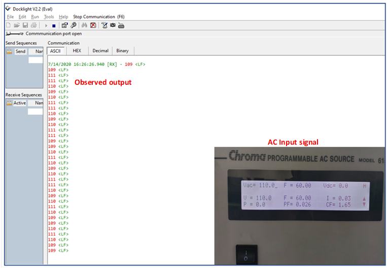
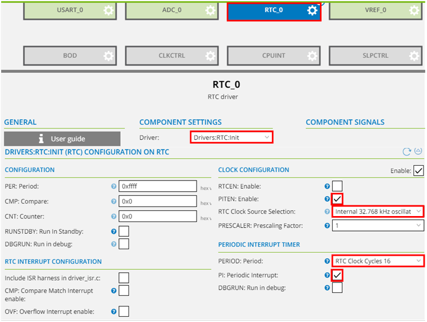
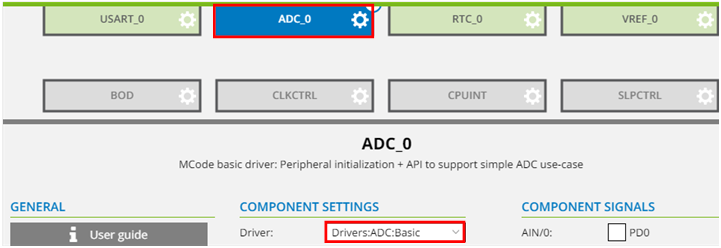
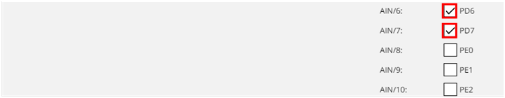
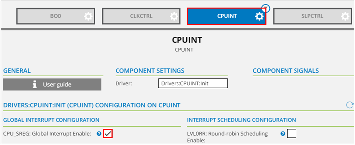

<!-- Please do not change this html logo with link -->

# ADC AC voltage measurement Studio example

## Introduction
The AVR128DA48 features one 12-bit differential ADC. Differential ADC is used to measure the voltage difference between the two input channels. This example demonstrates the AC voltage measurement using differential ADC.

**Note:** ***This example could be generated with all the pin variants of AVR-DA family of microcontrollers.***

## Useful links

- [AVR128DA48 Product Page](https://www.microchip.com/wwwproducts/en/AVR128DA28 "AVR128DA48 Product Page")
- [AVR128DA48 Code Examples on GitHub](https://github.com/microchip-pic-avr-examples?q=avr128da48 "AVR128DA48 Code Examples on GitHub")
- [AVR128DA48 Project Examples in START](https://start.atmel.com/#examples/AVR128DA48CuriosityNano "AVR128DA48 Project Examples in START")
- [ADC AC voltage measurement - MPLABX Example]( https://github.com/microchip-pic-avr-examples/avr128da48-3bit-ring-counter-start-example.git "ADC AC voltage measurement - MPLABX Example")

## Demo Description

  
   <strong>Fig 1: Block diagram view of the system used for AC voltage measurement 

In this demo,

* AC input to be measured is fed to the voltage stepdown circuit.
* Stepped down AC voltage is fed to the ADC +ve channel after offset voltage addition as shown in waveform in Fig 2.  And reference offset voltage is given as input to the -ve channel of the ADC. 

  
   <strong>Fig 2: Waveform of AC signal input to the MCU 

* Periodic interrupt is used as a trigger for the ADC to start the conversion for every 500 microsecs delay. 
* After capturing the required number of samples , RMS voltage is calculated using the captured sampled result and the formulae used for calculation is 

  

  

* Calculated RMS voltage is displayed on terminal window through USART peripheral.

## Application code flow diagram

  
   <strong>Fig 3: Application Code flow diagram 

## Software used:

- [MPLAB X IDE v5.40](https://www.microchip.com/mplab/mplab-x-ide "MPLAB X IDE v5.40")
- [XC8 Compiler v2.20](https://www.microchip.com/mplab/compilers "XC8 Compiler v2.20")
- [MPLAB Code Configurator (MCC) v3.95.0](https://www.microchip.com/mplab/mplab-code-configurator "MPLAB Code Configurator (MCC) v3.95.0")
- [AVR8bit Lib v2.3.0](https://www.microchip.com/mplab/mplab-code-configurator "AVR8bit Lib v2.3.0")
- [AVR-Dx DFP 1.1.40](https://packs.download.atmel.com/ "AVR-Dx DFP 1.1.40")

**Note: For running the demo, the installed tool versions should be the same or later. This example is not tested with the previous versions.**

## Hardware used:

* AVR128DA48 Curiosity Nano Evaluation Kit [[Part Number:DM164151]](https://www.microchip.com/DevelopmentTools/ProductDetails/PartNO/DM164151 "[Part Number:DM164151]")

  
   <strong>Fig 4 : AVR128DA48 Curiosity Nano Evaluation Kit 

 

## Hardware setup:

  
   <strong>Fig 5 : Hardware setup 

 

  
   <strong>Fig 6 : Voltage stepdown block diagram 

 

  
   <strong>Fig 7 : Hardware connections diagram 

 

## Demo Operation

* Setup the hardware as shown in Hardware connections diagram in Fig 7 of the hardware setup section in Fig 5.
* After the curiosity nano board is powered up, load the application firmware to AVR128DA48 microcontroller.
* Set the desired AC input voltage and frequency from the AC source and check the data displayed on terminal window.
* Some test data is shown in the below figures. For example : Set the AC input voltage to 50V and frequency to 50Hz and observe the measured RMS voltage displayed on terminal window as shown in Fig 8.

  
   <strong>Fig 8 : Observed output on terminal window for 50V AC input voltage and 50Hz frequency 

 

* Set the AC input voltage to 250V and frequency to 50Hz and observe the measured RMS voltage displayed on the terminal window as shown in Fig 9.

  
   <strong>Fig 9 : Observed output on terminal window for 250V AC input voltage and 50Hz frequency 

 

* Set the AC input voltage to 50V and frequency to 60Hz and observe the measured RMS voltage displayed on the terminal window as shown in Fig 10.

  
   <strong>Fig 10 : Observed output on terminal window for 50V AC input voltage and 60Hz frequency 

* Set the AC input voltage to 110V and frequency to 60Hz and observe the measured RMS voltage displayed on terminal window as shown in Fig 11.

  
   <strong>Fig 11 : Observed output on terminal window for 110V AC input voltage and 60Hz frequency 

## Conclusion : 

The demo provides an example of differential ADC application using the 12-bit ADC peripheral on the new AVR-DA family. For more details about the peripheral’s configuration refer Appendix Atmel START Project creation. 

## Appendix : Atmel START Project creation

Configure ADC, GPIO, RTC, USART peripherals  through Atmel START code configurator and generate Atmel Studio project. 
Follow the below steps to generate the project using Atmel START.
1.	Open **Atmel Studio 7**.
2.	Go to **File → New** and click on **Atmel Start Project** option.
3.	The CREATE NEW PROJECT window appears within Atmel Studio 7. In the "Filter on device..." text box, enter AVR128DA48, then select AVR128DA48 Curiosity Nano from the list and then click on CREATE NEW PROJECT, as shown in Fig 9. Wait until project creation is completed.

  
   <strong>Fig 12 : Create New Project 

4.	Add ADC, USART, VREF and RTC peripheral drivers to the project as shown in the Fig 13.
  * Click icon in the navigation tab, located on the left side of the window. Then, 
open the **ADD SOFTWARE COMPONENTS** window by clicking icon.
       * Expand Drivers by clicking + icon.
       * To add respective drivers to the project  select ADC, USART, VREF, RTC and click on icon.
       * Add the respective drivers to the project by clicking the Add component(s).

  
   <strong>Fig 13 : ADD SOFTWARE COMPONENTS 

## 5. USART 1 Configuration : 

USART 1 peripheral is used to transmit the measured AC voltage onto the terminal window. Configure the USART1 peripheral by following the steps as shown in the Fig 14.
* Open the configuration window for USART by clicking on USART_0.
* Select USART1 option from the dropdown menu against the Instance field.
* Check the Printf support option, which allows to print a sequence of characters.
* Set the Baud Rate to 9600.

  
   <strong>Fig 14 : USART1 Configuration window 

## 6. VREF configuration: 

VREF is configured to provide reference voltage for ADC peripheral. Configure the VREF peripheral by following the steps as shown in the Fig 12.
* Open the configuration window for VREF by clicking on VREF_0.
* Check the ALWAYSON: Enable reference always ON for ADC0 option to enable the reference voltage for ADC peripheral.  
* Select the reference voltage VDD as reference from the drop-down menu against the REFSEL: Reference voltage for ADC0.   

  
   <strong>Fig 15 : VREF Configuration window 

## 7. RTC Configuration: 

RTC is configured in PIT (Periodic Interrupt Timer) mode , which generates a periodic interrupt after every 500 microseconds . The periodic interrupt is used as a trigger for the ADC to start differential conversion . Configure the RTC peripheral by following the steps as shown in the Fig 16.
* Open the configuration window for RTC peripheral by clicking on RTC_0.
* Check the PITEN: Enable option , which enables the PIT mode.
* Select the clock Internal 32.768KHz oscillator option from the drop-down menu against the RTC Clock Source Selection field, which uses 32.768KHz oscillator as a clock source for the PIT mode.
* Select the period RTC Clock Cycles 16 option from the drop-down menu against the PERIOD : Period field which generates 500 microsec delay.

  
   <strong>Fig 16 : RTC Configuration window 

## 8. ADC Configuration:

ADC is configured in differential mode and it is used to measure the ac voltage of the input signal. Configure the ADC peripheral by following the steps as shown in the below figures.
* Open the configuration window for ADC peripheral by clicking on ADC_0 as shown in fig below Fig 17.

  
   <strong>Fig 17 : ADC Configuration window 

* Check the GPIO PD6 and PD7 , where the input signal is fed.

  
   <strong>Fig 18 : GPIO Configuration window 

* Configure ADC in differential mode by selecting the Differential Mode Conversion option from the drop-down menu against the CONVMODE: Differential Mode Conversion field as shown in Fig 16.
* Check the Enable field to enable the differential mode conversion.
* Select the ADC input pin 7 option from the drop-down menu against MUXNEG: Analog Channel Selection Bits.
* Select the ADC input pin 6 option from the drop-down menu against MUXPOS: Analog Channel Selection Bits.
* Check the RESRDY: Result Ready Interrupt Enable option, which enables the ADC result ready interrupt.
* Check the ENABLE: ADC Enable option , which enables the ADC.
* Select the clock CLK_PER divided by 2 option from the drop-down, which generates 2MHz frequency as a clock to the ADC.

  
   <strong>Fig 19 : ADC Configuration window 

## 9. Global Interrupt Enable configuration : 

To generate the interrupt, it is required to enable the Global Interrupt Enable bit in the Status register.
* Click on the icon next to "Show system drivers" option, as shown in the Fig 20.

  
   <strong>Fig 20 : ADC Configuration window 

* Click the CPUINT and then select the checkbox, CPU_SREG: Global Interrupt Enable, as shown in the Fig 21.

  
   <strong>Fig 21 : ADC Configuration window 

 

